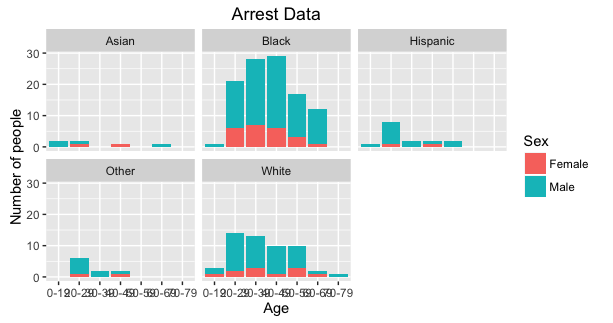

```{r setup, include=FALSE}
knitr::opts_chunk$set(echo = TRUE)
```

## Outline

## 1. Introduction: Amy

## 2. Graph + Findings 
      - Stop Data: Mengyu
      - Jail & Arrest: Jenny

## 3. Maps
      - Rebecca 

```{r}
setwd("~/Desktop/Stats R/PROJECT/finalproject_angry_ladies/Jenny_Analysis")
```


## About the Berkeley Police Arrest Log

The 'Berkeley Police Arrest Log' dataset provides information for adults arrested by the Berkeley Police Department over the past 30 days. Arrests include both felonies and misdemeanors. Arrests include persons booked into a jail facility and those cited and released with a future court date. The data are updated each business day (Monday through Friday, excluding holidays) at 9:00 am. At this time, the arrest location, arrest city, arrest latitude and longitude are not available. 

Links:


Person                   | Time
------------------------ | --------------------
Arrest Number            | A sequential index number
Date and Time            | Date and Time of the arrest person
Arrest Type              | The type of arrest that was made
Subject                  | The name of the arrest person
Race                     | The race of the arrest person
Sex                      | The gender of the arrest person
Age                      | The age of the arrest person
Status Type              | The statutory code the statute number is found in. 
Case Number              | The associated case number for the police report documenting the arrest. 





## About the Berkeley Police Jail Booking Log

The 'Berkeley Police Jail Booking Log' dataset provides information  for those adults booked into the Berkeley Police Department Jail facility over the past 30 days. Bookings may be for any law enforcement agency utilizing the Berkeley Jail (not exclusively the Berkeley Police Department).The data are updated each business day (Monday through Friday, excluding holidays) at 9:00 am. At this time, the arrest location, arrest city, arrest latitude and longitude are not available. 


## arrest time and booking time


